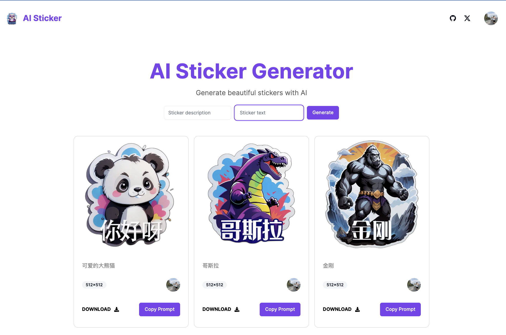

# AI Sticker

AI Sticker Generator by [aiapps.fun](https://aiapps.fun)

## Live Demo

[https://aiapps.fun](https://aiapps.fun)



## Quick Start

1. clone project

```shell
git clone https://github.com/all-in-aigc/aisticker
```

2. install dependencies

```shell
cd aisticker
pnpm install
```

3. init database

create your database use [local postgres](https://wiki.postgresql.org/wiki/Homebrew) or [vercel-postgres](https://vercel.com/docs/storage/vercel-postgres) or [supabase](https://supabase.com/)

create tables from sql at `data/install.sql`

4. set environmental values

put `.env.local` under `aisticker` root dir with values list below

```
OPENAI_API_KEY=""

COMFYUI_ENDPOINT=

MALETTE_API_KEY=

POSTGRES_URL=

AWS_AK=
AWS_SK=
AWS_REGION=
AWS_BUCKET=

NEXT_PUBLIC_CLERK_PUBLISHABLE_KEY=
CLERK_SECRET_KEY=
NEXT_PUBLIC_CLERK_SIGN_IN_URL=/sign-in
NEXT_PUBLIC_CLERK_SIGN_UP_URL=/sign-up
NEXT_PUBLIC_CLERK_AFTER_SIGN_IN_URL=/
NEXT_PUBLIC_CLERK_AFTER_SIGN_UP_URL=/

STRIPE_PUBLIC_KEY=""
STRIPE_PRIVATE_KEY=""

WEB_BASE_URI=""
```

5. local development

```shell
pnpm dev
```

open `http://localhost:3000` for preview

## Credit to

- [aiwallpaper](https://github.com/all-in-aigc/aiwallpaper) for code reference
- [nextjs](https://nextjs.org/docs) for full-stack development
- [clerk](https://clerk.com/docs/quickstarts/nextjs) for user auth
- [aws s3](https://docs.aws.amazon.com/AmazonS3/latest/userguide/upload-objects.html) for image storage
- [stripe](https://stripe.com/docs/development) for payment
- [node-postgres](https://node-postgres.com/) for data processing
- [tailwindcss](https://tailwindcss.com/) for page building

## Other Things

you can contact me at Twitter: https://twitter.com/jinchanzx
